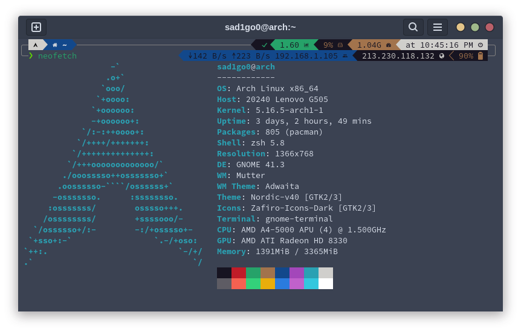

<h1 align="center">My dot files</h1>

<ul>
  <li><b>OS:</b> Arch Linux</li>
  <li><b>Shell:</b> zsh (oh my zsh)</li>
  <li><b>WM:</b> bspwm</li>
  <li><b>Terminal:</b> kitty</li>
  <li><b>Terminal Font:</b> JetBrainsMono Nerd Font Mono</li>
  <li><b>Terminal Theme:</b> powerlevel10k</li>
</ul>

  Used tools:  
  neovim  
  figlet  
  lolcat  
  cmatrix  
  nerdfetch  
  cava  
  neofetch

