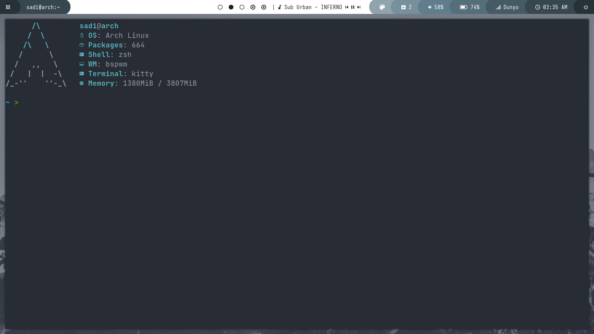

<h1 align="center">My configuration files</h1>

<ul>
  <li>OS: Arch Linux</li>
  <li>Shell: zsh (oh my zsh)</li>
  <li>Terminal Font: Source Code Pro</li>
  <li>Theme: Nordic</li>
  <li>Icons: Zafiro</li>
</ul>
